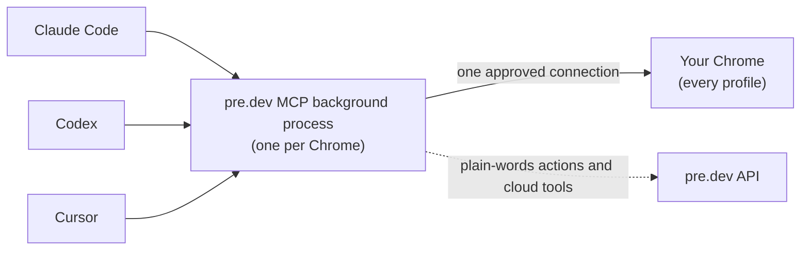

<p align="center">
  <a href="https://pre.dev/browser-agents">
    <picture>
      <source media="(prefers-color-scheme: dark)" srcset="assets/predev-logo-white.png">
      
    </picture>
  </a>
</p>

<h1 align="center">pre.dev MCP</h1>

<p align="center">
  <b>pre.dev in every coding agent.</b><br>
  Browser agents in the Chrome you already have open and in the cloud, plus specs and plans. One command to set up. Free and open source.
</p>

<p align="center">
  <a href="LICENSE"></a>
  <a href="https://www.npmjs.com/package/@predotdev/mcp"></a>
  
  
  
  <a href="https://pre.dev"></a>
</p>

---

One MCP server gives your coding agent everything pre.dev does:

- **Browser Agents Local: your own Chrome.** Open a tab in your work profile, read a dashboard you are already logged into, fill in a form, click through a flow and screenshot the result, all in the Chrome you use every day. No second browser, nothing to log into again, no cookies copied anywhere.
- **Browser Agents in the cloud.** Send a URL and a task to pre.dev's browsers and get structured data back, many runs in parallel.
- **Specs and plans.** Plan an app or feature before building it: architecture, tech stack, milestones and user stories.

It works with **any coding agent**: Claude Code, Codex, Hermes, Pi, OpenClaw, Cursor, GitHub Copilot, Cline, Gemini CLI and Antigravity, OpenCode, Zed, Goose, the [pre.dev CLI](https://pre.dev) and 20 more, and any agent that can run a shell command. Run as many agents as you like at the same time. They all share one connection to Chrome, so Chrome only asks you to allow it once.

Built with the [pre.dev CLI](https://docs.pre.dev/cli/overview).

## Quick start

You need **macOS**, **Google Chrome** and **Node.js 22 or newer** (check with `node --version`). Run one command:

```bash
npx -y @predotdev/mcp setup
```

It walks you through everything:

1. **Adds it to every coding agent on your Mac**: Claude Code, Codex, Hermes, Pi, OpenClaw, Cursor, Copilot CLI, Cline, Antigravity, Gemini CLI, OpenCode, VS Code, Claude Desktop, the pre.dev CLI and more (28 in all; [list](#setup-for-every-agent)). Already using the hosted pre.dev MCP? This one includes all of its tools, so setup replaces it.
2. **Connects to Chrome.** The first time, it asks you to turn on remote debugging at `chrome://inspect/#remote-debugging` (it copies the address for you), and Chrome asks **"Allow remote debugging?"**: click **Allow**.
3. **Signs you in to pre.dev** in your browser (or creates a free account), for plain-words actions and the cloud tools. Approve, and your key is saved for every agent; nothing to copy. Already signed in to the pre.dev CLI? It uses that login. Optional: press Enter to skip, and the Chrome tools still work.

Then restart your agent and try:

> List my Chrome profiles and the tabs I have open.

> [!TIP]
> **Or let your agent do it.** Paste this into Claude Code (or any coding agent):
> *Run `npx -y @predotdev/mcp setup` with a 10 minute timeout and tell me what to click.*

The command is safe to run again at any time. The copy it installs keeps itself up to date (see [How it works](#how-it-works)), and running setup again also updates it. `npx -y @predotdev/mcp check` shows the state of everything, and `uninstall` removes it from every agent.

### Coming from Claude in Chrome?

Run the setup command above, then type `/chrome` in Claude Code and turn off **Enabled by default** (or start a session with `claude --no-chrome`). Your Chrome profiles and logins carry over, because this server drives the Chrome you already use. The [switching guide](https://docs.pre.dev/browser-agents/switch-from-claude-in-chrome) maps each Claude in Chrome tool to its pre.dev tool and has a line you can paste into `CLAUDE.md`.

## Local or cloud?

Both editions of pre.dev Browser Agents are in this server, and your agent picks per task.

| | **Local** (`chrome_*` tools) | **[Cloud](https://docs.pre.dev/browser-agents/overview)** (`browser_agent`) |
| --- | --- | --- |
| Runs in | Your own Chrome | pre.dev's browsers |
| Logged in as | You, in every profile you use | Nobody (public pages) |
| Driven by | Your coding agent, step by step | One API call with a URL and a task |
| Best for | Dashboards, internal tools, admin panels, anything behind your login | Structured data from public sites, many runs in parallel |
| Also available | Only here | The REST API and SDKs |

## What your agent can do

**In your own Chrome** (run on your Mac):

| Tool | What it does |
| --- | --- |
| `chrome_profiles` | List your Chrome profiles (name, Google account) and how many tabs each has open |
| `chrome_tabs` | List open tabs grouped by profile |
| `chrome_open` | Open a URL in a specific profile, in the background by default so you are not interrupted; returns once the page has loaded |
| `chrome_navigate` | Load a URL in a tab, or go back, forward or reload |
| `chrome_snapshot` | List the clickable and typeable elements on a page as short refs (`[e1]`, `[e2]`, ...), with each link's address (tracking parameters removed) |
| `chrome_click` | Click by ref, CSS selector, visible text or coordinates, with real mouse events |
| `chrome_type` | Type into inputs, text areas, rich editors and dropdowns |
| `chrome_act` | Click or type into an element described in plain words, in one call ([plain-words actions](#plain-words-actions)) |
| `chrome_press` | Press keys and shortcuts (`Enter`, `Tab`, `cmd+a`, `shift+Tab`) |
| `chrome_scroll` | Scroll the page or bring an element into view |
| `chrome_read` | Read a page's text without site menus, footers and off-screen panels (`full` keeps them), paged for long pages. `selector` reads just the matching elements and `links` adds their URLs, so a results page's names, prices and product links come back in one call. When a selector matches nothing, it lists the page's repeated items (result cards) with selectors that work |
| `chrome_screenshot` | Screenshot the visible area or the full page |
| `chrome_wait` | Wait for text, a selector, a URL change, or a plain-words condition; with only a tab, until the page has loaded and stopped changing |
| `chrome_eval` | Run JavaScript in the page and return the result |
| `chrome_upload` | Attach local files to an upload button or file input |
| `chrome_show` | Bring a tab to the front so you can see it or take over |
| `chrome_close` | Close a tab |

**In pre.dev's cloud** (need a pre.dev plan; on the free plan your agent sees them and can open the subscribe page for you):

| Tool | What it does |
| --- | --- |
| `browser_agent` | Run one or more tasks in pre.dev's cloud browsers: a URL plus an instruction or a JSON Schema for the output; returns each task's data |
| `browser_agent_list` / `browser_agent_get` | Earlier cloud runs, and one run with its step-by-step events |
| `fast_spec` / `deep_spec` | Plan an app or feature: architecture, tech stack, milestones and user stories (`deep_spec` adds subtasks) |
| `get_spec` / `list_specs` | A spec's status and result, and the specs you have made |
| `get_plan` | The verified plan of a project you own |

This is what your agent sees when it takes a snapshot:

```
Tab A137CF · Work <you@company.com> · Create your account
https://example.com/signup
Headings: "Create your account"
Scroll: 0/640px
[e1] textbox "Full name"
[e2] textbox "Email" value="you@company.com"
[e3] select "Plan" selected="Free"
[e4] checkbox "I agree to the terms" [unchecked]
[e5] button "Create account"
```

Every tab is labeled with the profile it belongs to, so the agent always knows which account it is acting as.

## Plain-words actions

Once you are signed in to pre.dev (`setup` or `login` does it, or set `PREDEV_API_KEY`), two things turn on:

- `chrome_act`: click or type into an element described in plain words, like *"the Create button in the dialog"*, in under a second with no snapshot needed. If it isn't sure, it lists the likely matches instead of guessing.
- `chrome_wait` with `condition`: wait until a plain-words statement about the page is true, like *"the export has finished"*.

**Pricing.** The MCP server is free and open source, and the Chrome tools run free on your Mac. Plain-words actions and the cloud tools use pre.dev credits, the same credits as the rest of pre.dev ([pricing](https://pre.dev/pricing)). Each action costs a small fraction of one credit, and the free trial's credits cover hundreds of them. They show up in your usage as `browser-agents-local`, and `check` shows your plan. If the free plan's allowance or your credits run out, your agent tells you and offers to open the [billing page](https://pre.dev/billing) in your Chrome; everything else keeps working. Every other tool runs entirely on your machine and never calls pre.dev.

## Setup for every agent

`setup` does this for you. To add it by hand instead (for example to an agent `setup` doesn't know), every agent runs the same command. Sign in once with `npx -y @predotdev/mcp login` and leave the key out, or put your key from [Integrations → Built-in](https://pre.dev/projects/integrations) in the agent's environment:

```
npx -y @predotdev/mcp        env: PREDEV_API_KEY=your_key   (optional after login)
```

`setup` finds and configures each of these that is installed: Claude Code, Codex, Hermes, Pi, OpenClaw, Cursor (editor and CLI), Windsurf, GitHub Copilot CLI, Antigravity, Gemini CLI, Cline, Kiro, Qwen Code, Factory Droid, Augment, Amp, Kilo Code, Kimi Code, Junie, Warp, Rovo Dev, OpenHands, LM Studio, OpenCode, VS Code, VS Code Insiders, Claude Desktop and the pre.dev CLI. Devin CLI, Grok Build and Warp also read Claude Code's or Cursor's config, so they pick it up from there. Zed's settings file usually has comments, so `setup` leaves it to you (below).

<details>
<summary><b>Claude Code</b></summary>

```bash
claude mcp add --scope user predev -e PREDEV_API_KEY=your_key -- npx -y @predotdev/mcp
```

</details>

<details>
<summary><b>Hermes</b></summary>

```bash
hermes mcp add predev --command npx --args -y @predotdev/mcp
hermes config set mcp_servers.predev.timeout 900
```

Answer `Y` to turn on its tools. The longer timeout gives specs and cloud runs time to finish. In a running chat, `/reload-mcp` picks it up.

</details>

<details>
<summary><b>Pi</b></summary>

```bash
pi mcp add predev -- npx -y @predotdev/mcp
pi mcp list
```

`pi mcp list` should say `predev: connected`. `pi mcp add` needs Pi 0.99 or newer. On an older Pi, run `pi install npm:pi-mcp-adapter` and add the `predev` entry to `~/.pi/agent/mcp.json` by hand (`setup` writes it for you).

</details>

<details>
<summary><b>pre.dev CLI</b></summary>

In the pre.dev CLI, type `/chrome` (and `/chrome off` to turn it off). The CLI has pre.dev's cloud tools built in, so it only needs the Chrome tools, and the server uses your pre.dev CLI login. `/chrome` and `setup` both add this to `~/.predev/mcp.json`:

```json
{
  "mcpServers": {
    "predev": {
      "command": "npx",
      "args": ["-y", "@predotdev/mcp"],
      "env": { "PREDEV_MCP_CLOUD": "off" }
    }
  }
}
```

The agent sees the tools as `predev_chrome_open`, `predev_chrome_act` and so on.

From the pre.dev CLI, `predev mcp setup` runs this package's `setup` for your other agents.

</details>

<details>
<summary><b>Codex</b></summary>

```bash
codex mcp add predev --env PREDEV_API_KEY=your_key -- npx -y @predotdev/mcp
```

Or add this to `~/.codex/config.toml`. The longer timeout gives specs and cloud runs time to finish:

```toml
[mcp_servers.predev]
command = "npx"
args = ["-y", "@predotdev/mcp"]
env = { PREDEV_API_KEY = "your_key" }
tool_timeout_sec = 900
```

</details>

<details>
<summary><b>Cursor</b></summary>

Add to `~/.cursor/mcp.json`, then restart Cursor:

```json
{
  "mcpServers": {
    "predev": {
      "command": "npx",
      "args": ["-y", "@predotdev/mcp"],
      "env": { "PREDEV_API_KEY": "your_key" }
    }
  }
}
```

</details>

<details>
<summary><b>Windsurf</b></summary>

Add to `~/.codeium/windsurf/mcp_config.json`, then restart Windsurf:

```json
{
  "mcpServers": {
    "predev": {
      "command": "npx",
      "args": ["-y", "@predotdev/mcp"],
      "env": { "PREDEV_API_KEY": "your_key" }
    }
  }
}
```

</details>

<details>
<summary><b>VS Code (Copilot agent mode)</b></summary>

Add to `.vscode/mcp.json` in your project, or run **MCP: Open User Configuration** to add it for every project:

```json
{
  "servers": {
    "predev": {
      "type": "stdio",
      "command": "npx",
      "args": ["-y", "@predotdev/mcp"],
      "env": { "PREDEV_API_KEY": "your_key" }
    }
  }
}
```

</details>

<details>
<summary><b>Gemini CLI</b></summary>

Add to `~/.gemini/settings.json`:

```json
{
  "mcpServers": {
    "predev": {
      "command": "npx",
      "args": ["-y", "@predotdev/mcp"],
      "env": { "PREDEV_API_KEY": "your_key" }
    }
  }
}
```

</details>

<details>
<summary><b>OpenCode</b></summary>

Add to `~/.config/opencode/opencode.json`:

```json
{
  "mcp": {
    "predev": {
      "type": "local",
      "command": ["npx", "-y", "@predotdev/mcp"],
      "environment": { "PREDEV_API_KEY": "your_key" },
      "enabled": true
    }
  }
}
```

</details>

<details>
<summary><b>Claude Desktop</b></summary>

Desktop apps don't load your shell's `PATH`, so give them full paths. Install once:

```bash
npm install -g @predotdev/mcp
```

Then print the exact entry to paste:

```bash
echo "\"predev\": {\"command\": \"$(which node)\", \"args\": [\"$(npm root -g)/@predotdev/mcp/src/bridge.mjs\"], \"env\": {\"PREDEV_API_KEY\": \"your_key\"}}"
```

Put that entry inside `"mcpServers"` in `~/Library/Application Support/Claude/claude_desktop_config.json`, replace `your_key`, then restart Claude Desktop. The same trick works for any app that says it can't find `npx` or `node`.

</details>

<details>
<summary><b>More agents, by hand</b></summary>

Every entry below is the same server: command `npx`, arguments `-y @predotdev/mcp`.

| Agent | Command, or file and key |
| --- | --- |
| GitHub Copilot CLI | `copilot mcp add predev -- npx -y @predotdev/mcp`, or `~/.copilot/mcp-config.json` under `mcpServers` (add `"type": "local", "tools": ["*"]`) |
| Antigravity (`agy`) | `~/.gemini/config/mcp_config.json` under `mcpServers` |
| Cline | `cline mcp add predev --yes -- npx -y @predotdev/mcp`, or `~/.cline/data/settings/cline_mcp_settings.json` under `mcpServers` |
| Kiro | `kiro-cli mcp add --name predev --command "npx -y @predotdev/mcp" --scope global`, or `~/.kiro/settings/mcp.json` |
| Qwen Code | `qwen mcp add --scope user predev npx -y @predotdev/mcp` |
| Factory Droid | `droid mcp add predev "npx -y @predotdev/mcp"` |
| Augment (Auggie) | `auggie mcp add predev --command npx --args "-y @predotdev/mcp"` |
| Amp | `amp mcp add predev -- npx -y @predotdev/mcp` |
| OpenClaw | `openclaw mcp set predev '{"command":"npx","args":["-y","@predotdev/mcp"]}'` |
| Grok Build | `grok mcp add predev -- npx -y @predotdev/mcp` |
| Devin CLI | `devin mcp add -s user predev -- npx -y @predotdev/mcp` |
| OpenHands | `openhands mcp add predev --transport stdio npx -- -y @predotdev/mcp` |
| Kilo Code | `~/.config/kilo/kilo.jsonc` under `mcp`: `"predev": {"type": "local", "command": ["npx", "-y", "@predotdev/mcp"], "enabled": true}` |
| Kimi Code | `~/.kimi-code/mcp.json` under `mcpServers` |
| Junie | `~/.junie/mcp/mcp.json` under `mcpServers` |
| Warp | `~/.warp/.mcp.json` under `mcpServers` |
| Rovo Dev | `~/.rovodev/mcp.json` under `mcpServers` (add `"transport": "stdio"`) |
| LM Studio | `~/.lmstudio/mcp.json` under `mcpServers` |
| JetBrains AI Assistant | Settings → MCP → Import from Claude (after `setup` adds it to Claude Desktop) |

</details>

<details>
<summary><b>Zed</b></summary>

In `~/.config/zed/settings.json`:

```json
"context_servers": {
  "predev": { "command": "npx", "args": ["-y", "@predotdev/mcp"], "env": {} }
}
```

</details>

<details>
<summary><b>Goose</b></summary>

In `~/.config/goose/config.yaml`, under `extensions:`:

```yaml
  predev:
    type: stdio
    name: predev
    enabled: true
    cmd: npx
    args: [-y, "@predotdev/mcp"]
    envs: {}
    timeout: 900
```

For one session only: `goose session --with-extension "npx -y @predotdev/mcp"`.

</details>

<details>
<summary><b>Continue, Crush and Mistral Vibe</b></summary>

Continue, in `~/.continue/config.yaml`:

```yaml
mcpServers:
  - name: predev
    command: npx
    args: ["-y", "@predotdev/mcp"]
```

Crush, one line in `~/.config/crush/crushrc`:

```bash
mcp add predev --command npx --args -y --args @predotdev/mcp
```

Mistral Vibe, in `~/.vibe/config.toml`:

```toml
[[mcp_servers]]
name = "predev"
transport = "stdio"
command = "npx"
args = ["-y", "@predotdev/mcp"]
```

</details>

<details>
<summary><b>Agents without MCP (Aider, scripts, anything with a shell)</b></summary>

Every tool also runs from a shell, so any agent that can run commands can drive your Chrome:

```bash
npx -y @predotdev/mcp tools                       # list the tools and their arguments
npx -y @predotdev/mcp call chrome_open '{"profile":"Personal","url":"https://example.com"}'
npx -y @predotdev/mcp call chrome_snapshot '{"tab":"A1B2C3"}'
npx -y @predotdev/mcp call chrome_click '{"tab":"A1B2C3","ref":"e4"}'
```

Text goes to stdout, a screenshot is saved to a file and its path is printed, and the exit code is 1 when the tool failed. Point your agent at this section, or paste `npx -y @predotdev/mcp tools` into its instructions.

</details>

<details>
<summary><b>Any other MCP client</b></summary>

Add a local (stdio) server with command `npx`, arguments `-y @predotdev/mcp`, and the environment variable `PREDEV_API_KEY`. If the client can't find `npx`, use the full-path setup from the Claude Desktop section.

</details>

## How it works



- Chrome asks you to approve each debugging connection. Instead of every agent opening its own connection (and its own prompt), the first agent starts a small background process that holds **one** connection, and every agent talks to it. You click Allow once each time Chrome starts.
- Each agent uses its own pre.dev API key, even though they share the connection.
- The cloud tools are pre.dev's hosted MCP tools, passed through on the same key, so they stay current without updating this package.
- Tabs open in the background by default and are kept responsive while an agent works in them, so you can keep using Chrome.
- Page loads count as done when the page is loaded and has stopped changing (or has been still for a second while images and ads finish), so results that scripts fill in are there when the agent reads.
- Links come back as the page's own address: sponsored redirects resolve to where they go, Amazon product links become `/dp/<id>`, and tracking parameters are removed.
- Snapshots reach into shadow DOM and same-origin iframes, and clicks are real mouse events, so modern web apps behave the way they do for you.
- Updates: the copy `setup` installs checks npm at most every 6 hours, checks the download against npm's checksum and swaps in the new files. Tool changes apply from the next call, with no new Chrome approval; the rare update that changes how the background process talks to Chrome waits until you run `setup` again. `PREDEV_MCP_AUTO_UPDATE=off` turns this off.
- It has no dependencies: plain Node.js talking to Chrome's DevTools Protocol.

## Safety

This tool drives your real, logged-in Chrome. Read this before you turn it on.

- **Anything you can do in a tab, the agent can do.** Only connect agents you trust, and keep an eye on what they do on sensitive sites. `chrome_eval` runs JavaScript in the page. A page can contain text written to steer an agent; the agent is told to treat page content as data, not instructions, but watch what it does after reading sites you don't trust.
- **Passwords stay with you.** It refuses to type into password fields (except on `localhost` and `.test` dev sites) and masks the values of password, card number, security code, one-time code and other secret-looking fields in snapshots. It won't attach or open SSH keys, cloud credentials, `.env` files, your saved pre.dev key or Chrome's own data files. The agent is told never to enter passwords, payment details or government ID numbers.
- **It only listens on your machine.** The background process binds to `127.0.0.1` only and rejects requests without a random per-run token, which is stored in a file only you can read. It also rejects any request that comes from a web page.
- **What leaves your machine.** Plain-words actions send pre.dev what that one action needs, and pre.dev's AI model reads it to answer: `chrome_act` sends your description, the page's headings and its interactive elements (role, name and field value, with the secret fields above masked); a plain-words `chrome_wait` sends the condition, the page title, its URL (with token-like query values removed), the interactive elements and up to about 8,000 characters of the page's visible text. The cloud tools send what you ask them to do. Every other Chrome tool runs locally, though your agent's own AI model sees what the tools return.
- **Off switch.** Run `npx -y @predotdev/mcp stop` to stop the background process, or turn remote debugging off at `chrome://inspect/#remote-debugging`.

## Configuration

Set these in your agent's MCP config (`env`).

| Variable | What it does |
| --- | --- |
| `PREDEV_API_KEY` | Your pre.dev API key. Overrides the key saved by `login`, which overrides your pre.dev CLI login. |
| `PREDEV_MCP_CLOUD` | `off` lists only the Chrome tools, without pre.dev's cloud tools. |
| `PREDEV_API_URL` | The pre.dev API to call. Default `https://api.pre.dev`. |
| `PREDEV_MCP_AUTO_UPDATE` | `off` stops the copy `setup` installs from updating itself from npm. |
| `CHROME_MCP_USER_DATA_DIR` | Use a different Chrome data folder, for example Chrome Beta or a separate Chrome you started yourself. Each folder gets its own background process. |

State, logs, the stable copy `setup` installs and the key saved by `login` (readable only by you) are kept in `~/.predev/mcp/`.

## Commands

```bash
npx -y @predotdev/mcp setup      # add to every agent, connect to Chrome, sign in (optional; also updates)
npx -y @predotdev/mcp check      # check your setup, list your Chrome profiles, check your key
npx -y @predotdev/mcp login      # sign in to pre.dev again
npx -y @predotdev/mcp logout     # forget the saved key
npx -y @predotdev/mcp stop       # stop the background process (it restarts on the next tool call)
npx -y @predotdev/mcp uninstall  # remove it from every agent and delete its files
```

## Troubleshooting

| You see | Do this |
| --- | --- |
| `Chrome remote debugging is off` | Open `chrome://inspect/#remote-debugging` in Chrome and turn it on. |
| `Chrome is asking "Allow remote debugging?"` | Click **Allow** in Chrome, then ask your agent to try again. |
| Chrome asks to allow again | Normal after Chrome restarts. Updates keep the approved connection, except a rare one that changes how the background process talks to Chrome. |
| `Plain-words actions need a pre.dev account` | Run `npx -y @predotdev/mcp login`. No restart needed. |
| `pre.dev rejected the saved key` | Run `npx -y @predotdev/mcp login` again. |
| A message about credits or subscribing | Your workspace is out of trial credits. Subscribe or top up at [pre.dev/billing](https://pre.dev/billing). |
| Another server is already named `predev` | `setup` leaves it alone and registers this one as `pre-dev`. |
| You had the hosted pre.dev MCP or an older `chrome` install | `setup` replaced it; this server has all of its tools. |
| The agent can't start the server, or `npx`/`node` not found | Run `setup`: it registers full paths that work in desktop apps. |
| Codex says a tool call timed out | Set `tool_timeout_sec = 900` (see the Codex setup). |
| `codex exec` says a tool call `requires approval, but approval policy is never` | Non-interactive Codex can't ask you, so allow the tools for that run: `codex exec -c 'mcp_servers.predev.default_tools_approval_mode="approve"' "..."`. |
| Anything else | Run `npx -y @predotdev/mcp check`, and look at `~/.predev/mcp/predev-mcp.log`. |

## Platform support

**macOS** is supported and tested. **Linux** and **Windows** are not tested yet. The code looks for Chrome's data in the standard places (`~/.config/google-chrome` and `%LOCALAPPDATA%\Google\Chrome\User Data`), and on those systems a profile needs an open Chrome window before the agent can use it. Reports and pull requests are welcome.

## Development

```bash
git clone https://github.com/predotdev/mcp
cd mcp
node src/bridge.mjs check
```

Point your agent at `node /path/to/mcp/src/bridge.mjs`. Edits to `src/tools.mjs` reload automatically without dropping Chrome's approved connection: every call runs the calling copy's `tools.mjs`. The background process restarts (and Chrome asks you to allow again) only when `PROTOCOL` in `src/bridge.mjs` changes; bump it when you change the daemon's HTTP API, what it hands `tools.mjs`, or its Chrome connection code, or run `node src/bridge.mjs stop` to pick up other daemon edits.

## About

Free and open source from [pre.dev](https://pre.dev), built with the pre.dev CLI. Try it on your own project:

```bash
curl -fsSL https://pre.dev/install | bash
```

Want the same browser agents from your own code? Use the [REST API and SDKs](https://docs.pre.dev/browser-agents/overview).

MIT licensed. See [LICENSE](LICENSE).
