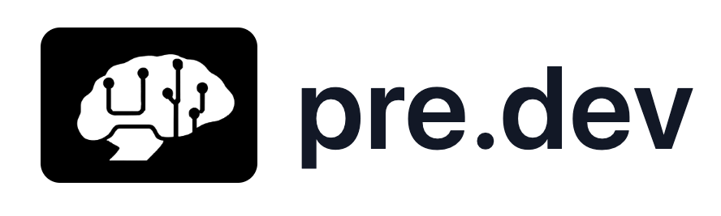
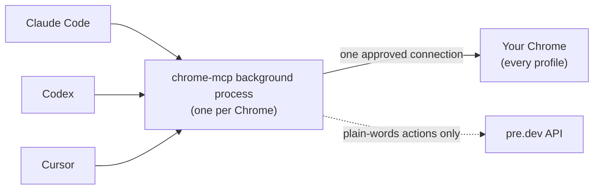

<p align="center">
  <a href="https://pre.dev/browser-agents">
    <picture>
      <source media="(prefers-color-scheme: dark)" srcset="assets/predev-logo-white.png">
      
    </picture>
  </a>
</p>

<h1 align="center">pre.dev Browser Agents Local</h1>

<p align="center">
  <b>Let any coding agent use the Chrome you already have open.</b><br>
  Your profiles, your logins, your tabs. One click to allow. Free and open source.
</p>

<p align="center">
  <a href="LICENSE"></a>
  
  
  <a href="https://www.npmjs.com/package/@predotdev/chrome-mcp"></a>
  
  <a href="https://pre.dev/browser-agents"></a>
</p>

---

This is the local edition of [pre.dev Browser Agents](https://pre.dev/browser-agents): an MCP server that lets your coding agent work in your own Chrome. It can open a tab in your work profile, read a dashboard you are already logged into, fill in a form, click through a flow and screenshot the result. There is no second browser to set up, nothing to log into again, and no cookies copied anywhere.

It works with **any coding agent that runs MCP servers locally**: Claude Code, Codex, Cursor, Windsurf, VS Code, Gemini CLI, OpenCode, Claude Desktop and more. Run as many agents as you like at the same time. They all share one connection, so Chrome only asks you to allow it once.

Built with the [pre.dev CLI](https://docs.pre.dev/cli/overview).

## Quick start

You need **macOS**, **Google Chrome** and **Node.js 22 or newer** (check with `node --version`). Run one command:

```bash
npx -y @predotdev/chrome-mcp setup
```

It walks you through everything:

1. **Signs you in to pre.dev** in your browser (or creates a free account). Approve, and your key is saved for every agent. Nothing to copy.
2. **Adds it to every coding agent on your Mac**: Claude Code, Codex, Cursor, Windsurf, VS Code, Gemini CLI, OpenCode and Claude Desktop.
3. **Connects to Chrome.** The first time, it asks you to turn on remote debugging at `chrome://inspect/#remote-debugging` (it copies the address for you), and Chrome asks **"Allow remote debugging?"**: click **Allow**.

Then restart your agent and try:

> List my Chrome profiles and the tabs I have open.

> [!TIP]
> **Or let your agent do it.** Paste this into Claude Code (or any coding agent):
> *Run `npx -y @predotdev/chrome-mcp setup` with a 10 minute timeout and tell me what to click.*

The command is safe to run again at any time, and running it again updates to the latest version. `npx -y @predotdev/chrome-mcp check` shows the state of everything, and `uninstall` removes it from every agent.

## Local or cloud?

pre.dev Browser Agents comes in two editions. Use whichever fits the job, or both.

| | **Local** (this) | **[Cloud](https://docs.pre.dev/browser-agents/overview)** |
| --- | --- | --- |
| Runs in | Your own Chrome | pre.dev's browsers |
| Logged in as | You, in every profile you use | Nobody (public pages) |
| Driven by | Your coding agent, step by step | One API call with a URL and a task |
| Best for | Dashboards, internal tools, admin panels, anything behind your login | Structured data from public sites, many runs in parallel |
| Setup | This MCP server | An API key, nothing to install |

## What your agent can do

| Tool | What it does |
| --- | --- |
| `chrome_profiles` | List your Chrome profiles (name, Google account) and how many tabs each has open |
| `chrome_tabs` | List open tabs grouped by profile |
| `chrome_open` | Open a URL in a specific profile, in the background by default so you are not interrupted |
| `chrome_navigate` | Load a URL in a tab, or go back, forward or reload |
| `chrome_snapshot` | List the clickable and typeable elements on a page as short refs (`[e1]`, `[e2]`, ...) |
| `chrome_click` | Click by ref, CSS selector, visible text or coordinates, with real mouse events |
| `chrome_type` | Type into inputs, text areas, rich editors and dropdowns |
| `chrome_act` | Click or type into an element described in plain words, in one call ([plain-words actions](#plain-words-actions)) |
| `chrome_press` | Press keys and shortcuts (`Enter`, `Tab`, `cmd+a`, `shift+Tab`) |
| `chrome_scroll` | Scroll the page or bring an element into view |
| `chrome_read` | Read a page's text, paged for long pages |
| `chrome_screenshot` | Screenshot the visible area or the full page |
| `chrome_wait` | Wait for text, a selector, a URL change, or a plain-words condition |
| `chrome_eval` | Run JavaScript in the page and return the result |
| `chrome_upload` | Attach local files to an upload button or file input |
| `chrome_show` | Bring a tab to the front so you can see it or take over |
| `chrome_close` | Close a tab |

This is what your agent sees when it takes a snapshot:

```
Tab A137CF · Work <you@company.com> · Create your account
https://example.com/signup
Headings: "Create your account"
Scroll: 0/640px
[e1] textbox "Full name"
[e2] textbox "Email" value="you@company.com"
[e3] select "Plan" selected="Free"
[e4] checkbox "I agree to the terms" [unchecked]
[e5] button "Create account"
```

Every tab is labeled with the profile it belongs to, so the agent always knows which account it is acting as.

## Plain-words actions

Once you are signed in to pre.dev (`setup` or `login` does it, or set `PREDEV_API_KEY`), two things turn on:

- `chrome_act`: click or type into an element described in plain words, like *"the Create button in the dialog"*, in under a second with no snapshot needed. If it isn't sure, it lists the likely matches instead of guessing.
- `chrome_wait` with `condition`: wait until a plain-words statement about the page is true, like *"the export has finished"*.

**Pricing.** The MCP server is free and open source. Plain-words actions are metered in pre.dev credits, the same credits as the rest of pre.dev. Each action costs a small fraction of one credit, and the free trial's credits cover more than a thousand actions. They show up in your usage as `browser-agents-local`, and `check` shows your plan. If the free plan's allowance or your credits run out, your agent tells you and offers to open the [billing page](https://pre.dev/billing) in your Chrome; everything else keeps working. Every other tool runs entirely on your machine and never calls pre.dev.

## Setup for every agent

`setup` does this for you. To add it by hand instead (for example to an agent `setup` doesn't know), every agent runs the same command. Sign in once with `npx -y @predotdev/chrome-mcp login` and leave the key out, or put your key from [Integrations → Built-in](https://pre.dev/projects/integrations) in the agent's environment:

```
npx -y @predotdev/chrome-mcp        env: PREDEV_API_KEY=your_key   (optional after login)
```

<details>
<summary><b>Claude Code</b></summary>

```bash
claude mcp add --scope user chrome -e PREDEV_API_KEY=your_key -- npx -y @predotdev/chrome-mcp
```

</details>

<details>
<summary><b>Codex</b></summary>

```bash
codex mcp add chrome --env PREDEV_API_KEY=your_key -- npx -y @predotdev/chrome-mcp
```

Or add this to `~/.codex/config.toml`. The longer timeout gives slow pages time to load:

```toml
[mcp_servers.chrome]
command = "npx"
args = ["-y", "@predotdev/chrome-mcp"]
env = { PREDEV_API_KEY = "your_key" }
tool_timeout_sec = 120
```

</details>

<details>
<summary><b>Cursor</b></summary>

Add to `~/.cursor/mcp.json`, then restart Cursor:

```json
{
  "mcpServers": {
    "chrome": {
      "command": "npx",
      "args": ["-y", "@predotdev/chrome-mcp"],
      "env": { "PREDEV_API_KEY": "your_key" }
    }
  }
}
```

</details>

<details>
<summary><b>Windsurf</b></summary>

Add to `~/.codeium/windsurf/mcp_config.json`, then restart Windsurf:

```json
{
  "mcpServers": {
    "chrome": {
      "command": "npx",
      "args": ["-y", "@predotdev/chrome-mcp"],
      "env": { "PREDEV_API_KEY": "your_key" }
    }
  }
}
```

</details>

<details>
<summary><b>VS Code (Copilot agent mode)</b></summary>

Add to `.vscode/mcp.json` in your project, or run **MCP: Open User Configuration** to add it for every project:

```json
{
  "servers": {
    "chrome": {
      "type": "stdio",
      "command": "npx",
      "args": ["-y", "@predotdev/chrome-mcp"],
      "env": { "PREDEV_API_KEY": "your_key" }
    }
  }
}
```

</details>

<details>
<summary><b>Gemini CLI</b></summary>

Add to `~/.gemini/settings.json`:

```json
{
  "mcpServers": {
    "chrome": {
      "command": "npx",
      "args": ["-y", "@predotdev/chrome-mcp"],
      "env": { "PREDEV_API_KEY": "your_key" }
    }
  }
}
```

</details>

<details>
<summary><b>OpenCode</b></summary>

Add to `~/.config/opencode/opencode.json`:

```json
{
  "mcp": {
    "chrome": {
      "type": "local",
      "command": ["npx", "-y", "@predotdev/chrome-mcp"],
      "environment": { "PREDEV_API_KEY": "your_key" },
      "enabled": true
    }
  }
}
```

</details>

<details>
<summary><b>Claude Desktop</b></summary>

Desktop apps don't load your shell's `PATH`, so give them full paths. Install once:

```bash
npm install -g @predotdev/chrome-mcp
```

Then print the exact entry to paste:

```bash
echo "\"chrome\": {\"command\": \"$(which node)\", \"args\": [\"$(npm root -g)/@predotdev/chrome-mcp/src/bridge.mjs\"], \"env\": {\"PREDEV_API_KEY\": \"your_key\"}}"
```

Put that entry inside `"mcpServers"` in `~/Library/Application Support/Claude/claude_desktop_config.json`, replace `your_key`, then restart Claude Desktop. The same trick works for any app that says it can't find `npx` or `node`.

</details>

<details>
<summary><b>Any other MCP client</b></summary>

Add a local (stdio) server with command `npx`, arguments `-y @predotdev/chrome-mcp`, and the environment variable `PREDEV_API_KEY`. If the client can't find `npx`, use the full-path setup from the Claude Desktop section.

</details>

## How it works



- Chrome asks you to approve each debugging connection. Instead of every agent opening its own connection (and its own prompt), the first agent starts a small background process that holds **one** connection, and every agent talks to it. You click Allow once each time Chrome starts.
- Each agent uses its own pre.dev API key, even though they share the connection.
- Tabs open in the background by default and are kept responsive while an agent works in them, so you can keep using Chrome.
- Snapshots reach into shadow DOM and same-origin iframes, and clicks are real mouse events, so modern web apps behave the way they do for you.
- It has no dependencies: plain Node.js talking to Chrome's DevTools Protocol.

## Safety

This tool drives your real, logged-in Chrome. Read this before you turn it on.

- **Anything you can do in a tab, the agent can do.** Only connect agents you trust, and keep an eye on what they do on sensitive sites. `chrome_eval` runs JavaScript in the page.
- **Passwords stay with you.** It refuses to type into password fields (except on `localhost` and `.test` dev sites) and masks password values in snapshots. The agent is told never to enter passwords, payment details or government ID numbers.
- **It only listens on your machine.** The background process binds to `127.0.0.1` only and rejects requests without a random per-run token, which is stored in a file only you can read. It also rejects any request that comes from a web page.
- **What leaves your machine.** Only plain-words actions send anything to pre.dev: the page's interactive elements and visible text for that one action. Every other tool runs locally.
- **Off switch.** Run `npx -y @predotdev/chrome-mcp stop` to stop the background process, or turn remote debugging off at `chrome://inspect/#remote-debugging`.

## Configuration

Set these in your agent's MCP config (`env`).

| Variable | What it does |
| --- | --- |
| `PREDEV_API_KEY` | Your pre.dev API key. Overrides the key saved by `login`. |
| `PREDEV_API_URL` | The pre.dev API to call. Default `https://api.pre.dev`. |
| `CHROME_MCP_USER_DATA_DIR` | Use a different Chrome data folder, for example Chrome Beta or a separate Chrome you started yourself. Each folder gets its own background process. |

State, logs, the stable copy `setup` installs and the key saved by `login` (readable only by you) are kept in `~/.predev/chrome-mcp/`.

## Commands

```bash
npx -y @predotdev/chrome-mcp setup      # sign in, add to every agent, connect to Chrome (also updates)
npx -y @predotdev/chrome-mcp check      # check your setup, list your Chrome profiles, check your key
npx -y @predotdev/chrome-mcp login      # sign in to pre.dev again
npx -y @predotdev/chrome-mcp logout     # forget the saved key
npx -y @predotdev/chrome-mcp stop       # stop the background process (it restarts on the next tool call)
npx -y @predotdev/chrome-mcp uninstall  # remove it from every agent and delete its files
```

## Troubleshooting

| You see | Do this |
| --- | --- |
| `Chrome remote debugging is off` | Open `chrome://inspect/#remote-debugging` in Chrome and turn it on. |
| `Chrome is asking "Allow remote debugging?"` | Click **Allow** in Chrome, then ask your agent to try again. |
| Chrome asks to allow again | Normal after Chrome restarts, or after this tool updates to a new version. |
| `Plain-words actions need a pre.dev account` | Run `npx -y @predotdev/chrome-mcp login`. No restart needed. |
| `pre.dev rejected the saved key` | Run `npx -y @predotdev/chrome-mcp login` again. |
| A message about credits or subscribing | Your workspace is out of trial credits. Subscribe or top up at [pre.dev/billing](https://pre.dev/billing). |
| A tool you added by hand named `chrome` already exists | `setup` leaves it alone and registers this one as `predev-chrome`. |
| The agent can't start the server, or `npx`/`node` not found | Run `setup`: it registers full paths that work in desktop apps. |
| Codex says a tool call timed out | Set `tool_timeout_sec = 120` (see the Codex setup). |
| Anything else | Run `npx -y @predotdev/chrome-mcp check`, and look at `~/.predev/chrome-mcp/chrome-mcp.log`. |

## Platform support

**macOS** is supported and tested. **Linux** and **Windows** are not tested yet. The code looks for Chrome's data in the standard places (`~/.config/google-chrome` and `%LOCALAPPDATA%\Google\Chrome\User Data`), and on those systems a profile needs an open Chrome window before the agent can use it. Reports and pull requests are welcome.

## Development

```bash
git clone https://github.com/predotdev/chrome-mcp
cd chrome-mcp
node src/bridge.mjs check
```

Point your agent at `node /path/to/chrome-mcp/src/bridge.mjs`. Edits to `src/tools.mjs` reload automatically without dropping Chrome's approved connection. Edits to `src/bridge.mjs` restart the background process, so Chrome asks you to allow again.

## About

Free and open source from [pre.dev](https://pre.dev), built with the pre.dev CLI. Try it on your own project:

```bash
curl -fsSL https://pre.dev/install | bash
```

Need browser work at scale instead? [pre.dev Browser Agents](https://pre.dev/browser-agents) runs tasks in the cloud from one API call.

MIT licensed. See [LICENSE](LICENSE).
